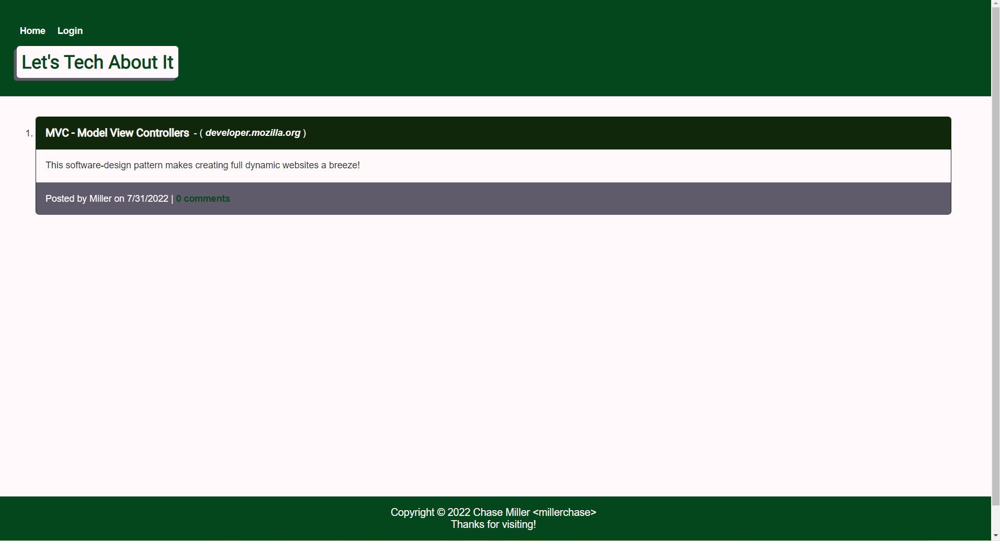
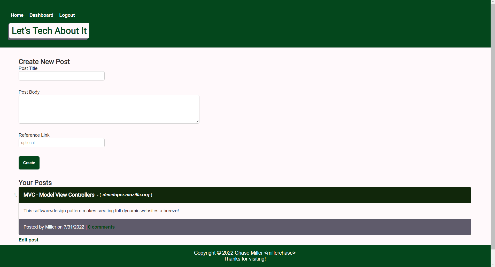

# Let's Tech About It

'Let's Tech About It' is a MVC style blog site built for discussing all things tech! Share anything new and exciting, or a solution you've found for a difficult issue. Add a reference link to share your sources. As well as commit on other view and comment on other developer's posts.

#### Deployed at: [https://lets-tech-about-it-73491.herokuapp.com/](https://lets-tech-about-it-73491.herokuapp.com/)

---

## Usage

Navigate to the link above, sign in, then start sharing!

---

---

## Technologies

- JavaScript
- express-handlebars
- express-session
- MySQL2
- Sequelize
- connect-session-sequelize
- bcrypt

## License

Copyright &copy; 2022 Chase Miller &lt;millerchase>

Permission is hereby granted, free of charge, to any person obtaining a copy of this software and associated documentation files (the "Software"), to deal in the Software without restriction, including without limitation the rights to use, copy, modify, merge, publish, distribute, sublicense, and/or sell copies of the Software, and to permit persons to whom the Software is furnished to do so, subject to the following conditions:

The above copyright notice and this permission notice shall be included in all copies or substantial portions of the Software.

THE SOFTWARE IS PROVIDED "AS IS", WITHOUT WARRANTY OF ANY KIND, EXPRESS OR IMPLIED, INCLUDING BUT NOT LIMITED TO THE WARRANTIES OF MERCHANTABILITY, FITNESS FOR A PARTICULAR PURPOSE AND NONINFRINGEMENT. IN NO EVENT SHALL THE AUTHORS OR COPYRIGHT HOLDERS BE LIABLE FOR ANY CLAIM, DAMAGES OR OTHER LIABILITY, WHETHER IN AN ACTION OF CONTRACT, TORT OR OTHERWISE, ARISING FROM, OUT OF OR IN CONNECTION WITH THE SOFTWARE OR THE USE OR OTHER DEALINGS IN THE SOFTWARE.

[https://opensource.org/licenses/MIT](https://opensource.org/licenses/MIT)

## Contributors

Created with ❤️ by Chase Miller.

## Questions

For any additional questions, find me on GitHub @ [millerchase](https://github.com/millerchase)
